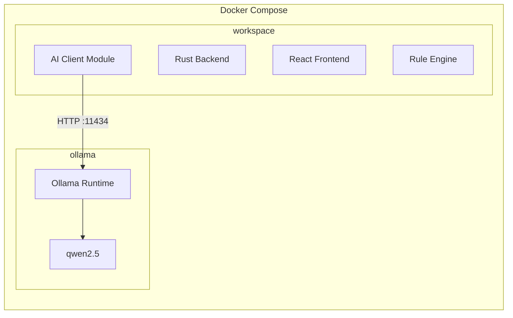

---

name: DevContainer Ollama 세팅
overview: PROJECT_SPEC와 LLM_DEV_PLAN에 따라 DevContainer를 docker-compose 기반으로 전환하고 Ollama 서비스를 추가하며 한국어 지원 LLM을 사용할 수 있는 개발 환경을 구성합니다.
todos: []
isProject: false
----------------

# DevContainer + Ollama 세팅 계획 (수정 버전)

이 문서는 DevContainer 환경에서 **로컬 LLM을 안정적으로 사용하기 위한 Docker Compose 기반 구조**를 정의합니다.

목표:

* DevContainer에서 Rust / React / Tauri 개발
* Ollama를 별도 서비스로 실행
* GPU 패스스루 지원
* 모델은 한 번만 다운로드
* Rust backend → Ollama API 호출
* LLM은 필요할 때만 호출하는 구조

---

# 1. 목표 아키텍처



구성:

workspace

* Rust backend
* React frontend
* Rule Engine
* AI Client

ollama

* LLM runtime
* 모델 저장

---

# 2. docker-compose.yml 생성

경로

```text
.devcontainer/docker-compose.yml
```

내용

```yaml
services:

  workspace:
    build:
      context: .
      dockerfile: Dockerfile

    volumes:
      - ..:/workspaces/life-rpg

    command: sleep infinity

    depends_on:
      - ollama

    environment:
      - OLLAMA_HOST=http://ollama:11434

    ports:
      - "1420:1420"

  ollama:
    image: ollama/ollama

    ports:
      - "11434:11434"

    volumes:
      - ollama-data:/root/.ollama

    # GPU support
    runtime: nvidia
    environment:
      - NVIDIA_VISIBLE_DEVICES=all

volumes:
  ollama-data:
```

설명

ollama-data 볼륨에 모델이 저장되므로 DevContainer를 재시작해도 모델을 다시 다운로드하지 않습니다.

---

# 3. devcontainer.json 수정

파일

```text
.devcontainer/devcontainer.json
```

수정

```json
{
  "name": "Life RPG Dev",

  "dockerComposeFile": "docker-compose.yml",

  "service": "workspace",

  "workspaceFolder": "/workspaces/life-rpg",

  "runArgs": ["--service-ports"],

  "remoteUser": "vscode"
}
```

중요

postStartCommand에서 모델을 다운로드하지 않습니다.

모델 설치는 별도의 스크립트로 수행합니다.

---

# 4. LLM 모델 선택

이 프로젝트에서는 **한국어 이해 능력이 좋은 모델**을 사용합니다.

추천 모델

1️⃣ qwen2.5:7b
2️⃣ qwen2.5:3b
3️⃣ phi3

권장 기본 모델

```text
qwen2.5:7b
```

이유

* 한국어 이해 능력 우수
* reasoning 성능
* 로컬 실행 가능

---

# 5. 모델 설치 방식

모델은 자동 다운로드하지 않습니다.

DevContainer 시작 후 **한 번만 설치**합니다.

스크립트

```text
.devcontainer/scripts/setup-ollama.sh
```

내용

```bash
#!/bin/bash

echo "Waiting for Ollama..."

until curl -s http://localhost:11434/api/tags > /dev/null; do
  sleep 2
done

echo "Ollama is ready"

docker compose exec ollama ollama pull qwen2.5:7b

echo "Model installation complete"
```

실행

```bash
./.devcontainer/scripts/setup-ollama.sh
```

---

# 6. Rust AI Client 연결

Rust backend는 Ollama REST API를 호출합니다.

endpoint

```text
http://ollama:11434/api/generate
```

환경 변수

```text
OLLAMA_HOST=http://ollama:11434
```

Rust 예시

```rust
let url = format!("{}/api/generate", std::env::var("OLLAMA_HOST")?);
```

---

# 7. LLM 호출 아키텍처

LLM은 **필요할 때만 호출**해야 합니다.

구조

```text
Activity Input
        │
        ▼
Pattern Matcher
        │
        ├─ Known Pattern → Rule Engine
        │
        └─ Unknown Pattern → LLM
```

예시

입력

```text
단어 30개 암기
```

Rule Engine

```text
vocab_count * 0.1 XP
```

LLM 호출 없음

---

입력

```text
오늘 JLPT 독해 지문 분석 공부
```

LLM 호출

---

# 8. LLM 출력 형식

LLM은 JSON만 반환해야 합니다.

예

```json
{
  "intelligence": 4,
  "discipline": 3,
  "focus": 2,
  "knowledge": 3
}
```

Rust에서 바로 파싱 가능해야 합니다.

---

# 9. GPU 요구사항

WSL2 환경에서 GPU 사용을 위해 다음이 필요합니다.

Windows

* 최신 NVIDIA driver

WSL2

* nvidia-container-toolkit

테스트

```bash
docker run --rm --gpus all nvidia/cuda:12.0-base nvidia-smi
```

---

# 10. 검증 체크리스트

DevContainer 빌드 후 확인

1️⃣ ollama 서비스 실행

```bash
docker compose ps
```

2️⃣ Ollama API 확인

```bash
curl http://ollama:11434/api/tags
```

3️⃣ 모델 설치

```bash
./.devcontainer/scripts/setup-ollama.sh
```

4️⃣ 모델 확인

```bash
docker compose exec ollama ollama list
```

---

# 11. 향후 확장

향후 다음 기능을 추가할 수 있습니다.

* activity 자동 분석
* productivity scoring
* AI coaching
* 자동 활동 추적
* 학습 패턴 분석
